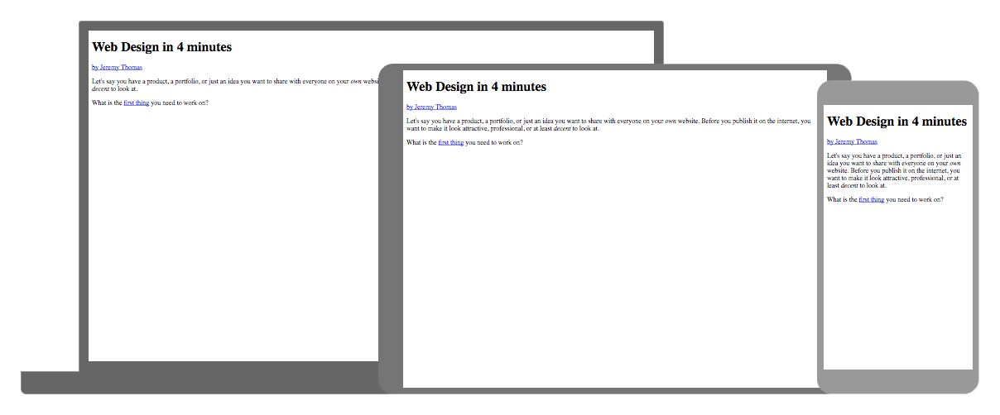
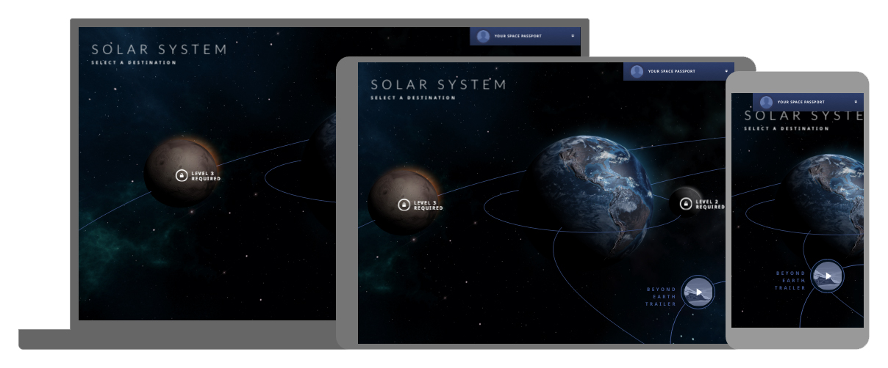
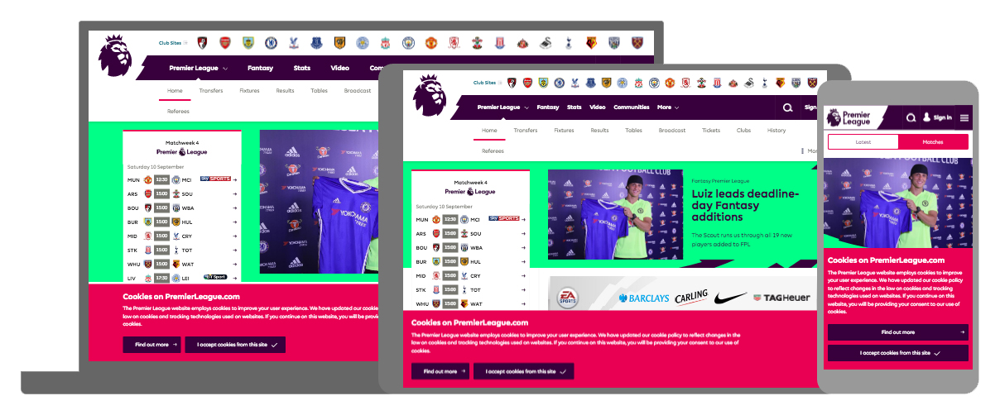
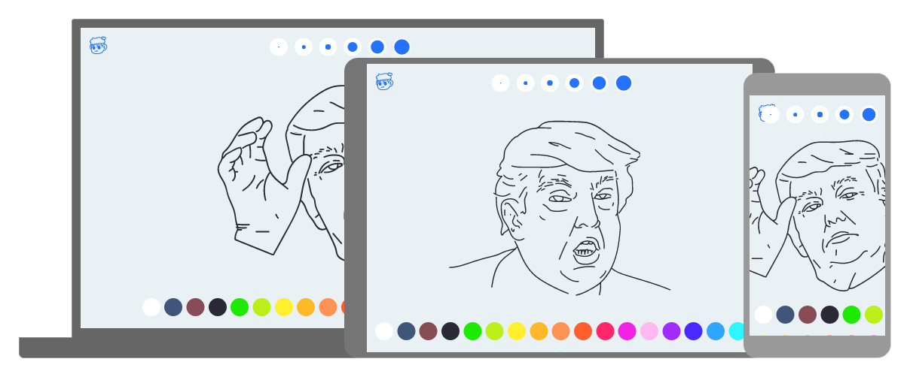
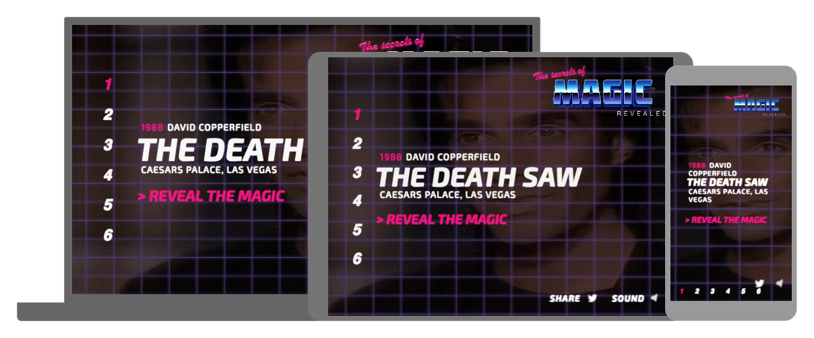

Liam’s Websites of the Month - August Edition
=============================================

Introduction

1.[ Web Design in 4 Minutes](http://jgthms.com/web-design-in-4-minutes/)

So the first winner is quite insightful and an inspired piece of learning. This websites shows on a very basic level how websites are made on a very basic level but nonetheless completely correct. It also shows how websites should be approached when being create as well. To create a very organic, natural and highly useable website it's best to start with the content and actually structuring the HTML markup to make sense before thinking about the flashy bits. Your HTML should have a logical order like a novel. This first winner provides nice interactivity and insight, the winner is... Wed Design in 4 Minutes

2.[ Space Advisor](http://www.space-advisor.ca/en/?experience)

The winner submitted by Smith has a whole host of reasons as to why it won but you simply need to see for yourself. It combines a very ambitious desktop experience with 3D, animation, sound and nice graphics with a mobile experience that connects to the desktop browser and allows you to play mini games etc from you phone! Black magic I hear you cry? No it's only... Space Advisor

3.[ The Premier League](https://www.premierleague.com/)

The third and final winner celebrates the return on the Premier League! Most United fans in the house are probably quietly optimistic at this point, I certainly am because if United keep doing well then it means I go home to a happy wife otherwise it's a grumpy little football hooligan lad 
The website does a good job of relaying quite a large amount of data and does very well on smaller devices despite having so much information on page.
The final winner and also this week's winner is... The Premier League

4.[ Donald Trump Colouring Book](http://obliterate.me/)

The first winner goes to a man who has created a colouring book for mature adults who appreciate the incredible lunacy and childlike nature of Donald Trump, you remember Trump Donald right? It's not as good as that but when else do you get a domain like this coupled with something so current? Please send in your bets colouring ins and gratifies! (Adam I'm expecting great things from you) The first winner is... Donald Trump Colouring Book!!!

5.[ Foxy Casino - The Secrets of Magic Revealed](https://www.foxycasino.com/featured/secrets-of-magic.html)

The second winner is a real golden nugget! It harkens back to 1980's action films and video games in terms of it's style and presentation. I especially love the colour pallete for this website as it instantly transports you to the era the content hails from. Some great design bits and animation used here. The second winner is... Secrets of Magic!!!
