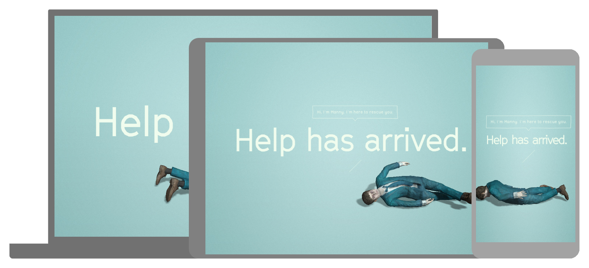
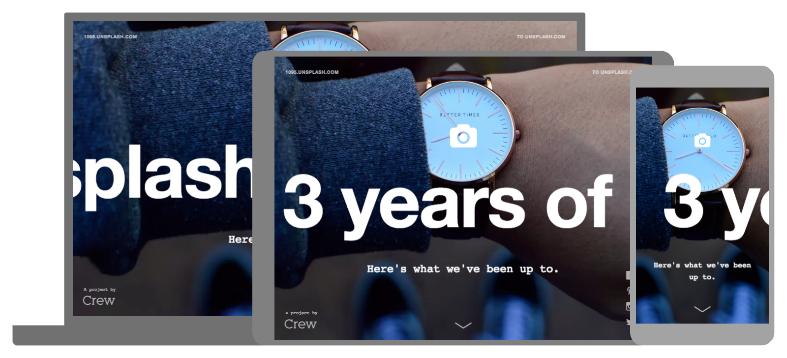
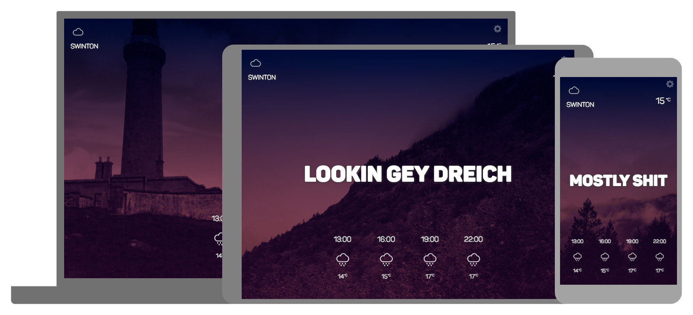
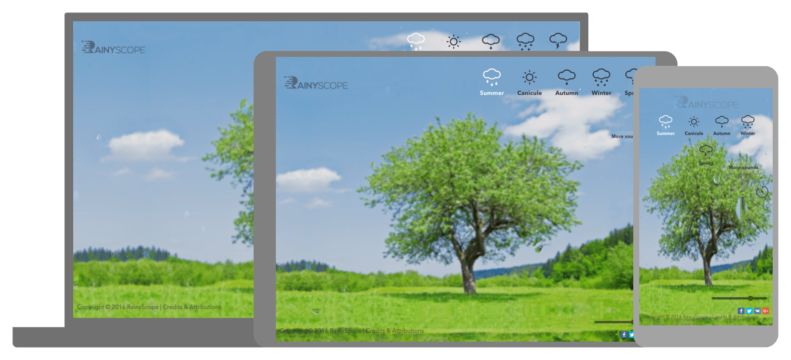

Liam’s Websites of the Month - July Edition
==================================================

Hello once again everyone!!! Another month and another horde of websites to feast your eyes upon. If you come seeking the very best the internet has to offer then you've come to the right place as I collate a website (or two... or three... depending on my mood and current events) every week to share with the world for those who don't have the time to mine the caves of internet gold so that all may bare witness to the true nature of the web! Let's start.

1.[ Swiss Army Man](http://swissarmyman.com/)

Swiss Army Man is a movie featuring Daniel Radcliffe playing as some kind of magical corpse and this incredible website was submitted as a candidate for #LWOTW by none other than Access' own [Ashley Johnson!](https://twitter.com/@johnnnnson) This website showcases some of latest techniques on the web for creating more interactive experiences beyond your simple UI. The builders made full use of the films quirky nature to create a bucket load of easter eggs for people to find. The controls for the website are a delight as well, being able to just type in words to find Daniel Radcliffe's character in different situations. You could spend ages playing this and is much like this [old flash game](http://www.interactivebuddy2.org/). The boy who lived stills lives (kind of) in this unique piece of internet wizardry.

2.[ 3 years of Unsplash - 1095 days later](https://1095.unsplash.com/)

Are you a designer? Developer? Photography enthusiast? Or just a member of the human race that has access to internet? The you've probably seen some of [Unsplash's](https://unsplash.com/) amazing photography in action on the web. This website showcases stats and information from Unsplash's short but wonderful three year history. It has great typography, makes good use of white space and delightfully subtle animations. It tells a compelling story about their journey as Unsplash, what they've made and done since the original website's launch. It's overall a very attractive and readable website but it's the content and use of imagery that keeps you scrolling and reading. Their story is a great one of success from humble beginnings, give some of the linked websites and projects a look as well it's all good!

3.[ Ootside](http://ootsi.de/)

We all like to talk about the weather when things are awkward right? Small talk about the weather is the original ice-breaker correct? And we all love the Scottish right? With their incredible lust for freedom from the English and labelling everything scotch-whatever even if they didn't invent it? Well [Ootside](http://ootsi.de/) makes use of some technical features like using Google address lookup for geolocation pinpointing and a weather API to get the weather for a specified location. It also makes good use of the Scottish accent to give us all a true representation of what the weather is actually like! This one is bound to put a smile on your face.

4.[ Rainyscope](http://rainyscope.com/)

Following on from the website being weather based, [Rainyscope](http://rainyscope.com/) is even more of a tech piece. Using the latest WebGL and animation crafty tricks this website shows what can be done using different filter layers combined with image manipulation and morphing! It's a basic site but the thought and knowledge behind making it is deep. It takes some skill to create something like this when there is no comparable counterpart to take a cue from. It takes even more technical skill and knowledge to take an idea like this from the mind and make it work so so well! Well done with this one.

---

Well that's it for this month! Please make sure to [follow on Twitter](https://twitter.com/search?q=%40LiamWalshWeb%20%23LWOTW&src=typd) each week where I will announce the winners I pick every Friday that go into LWOTM! Just watch out for [#LWOTW](https://twitter.com/search?q=%40LiamWalshWeb%20%23LWOTW&src=typd) to receive delightful, funny, amazing and sometimes crazy websites worthy of that little browse during lunch at work or wherever you might be. Hope you all enjoyed this month's issue and please feel free to [tweet me](https://twitter.com/LiamWalshWeb) if you've seen a great website or maybe you've made something worth shouting about! I'm all ears.
