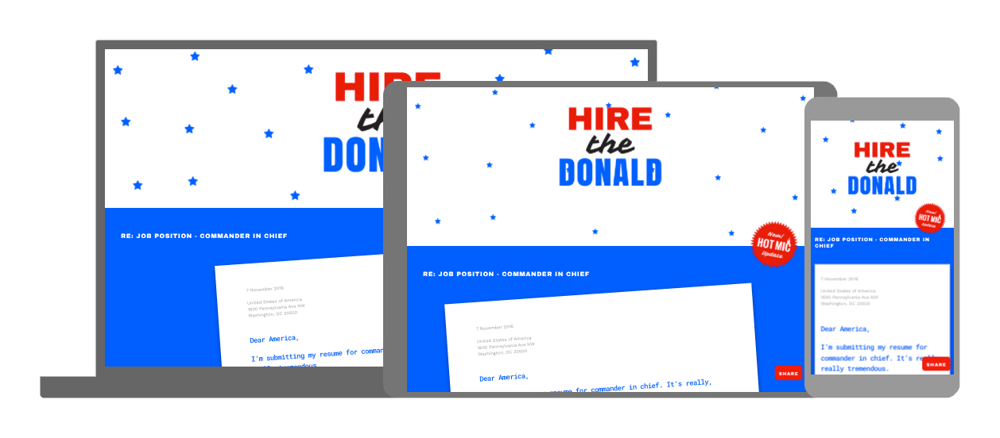
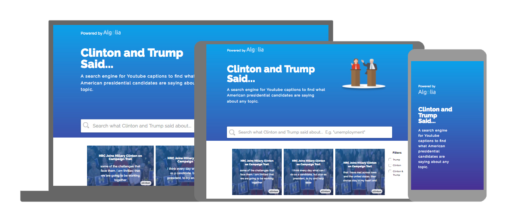
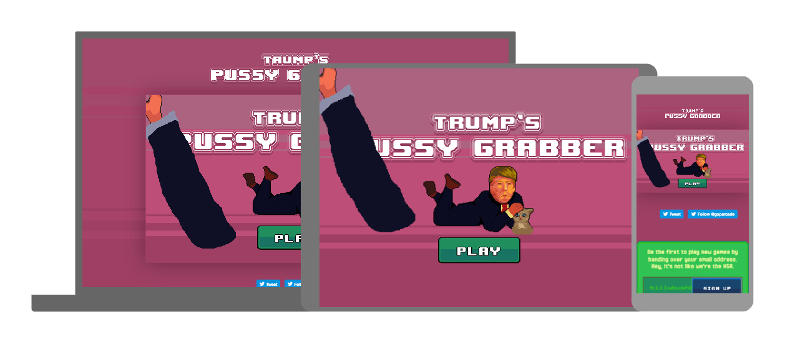
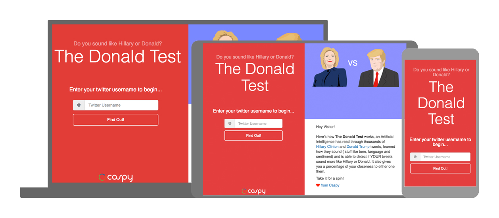
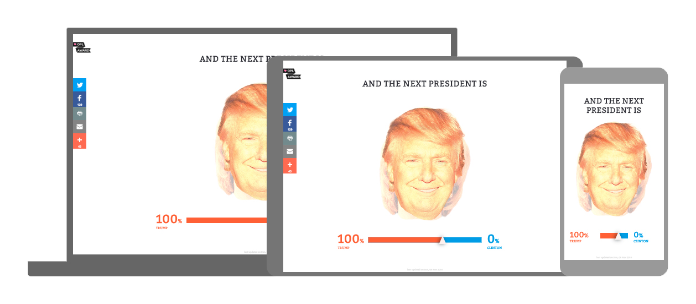
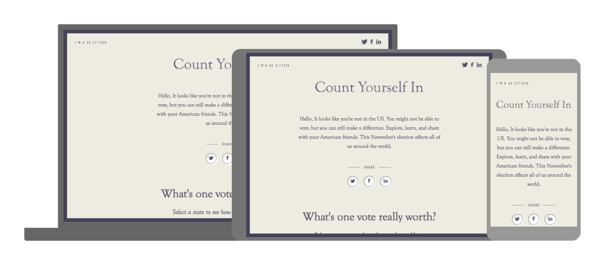
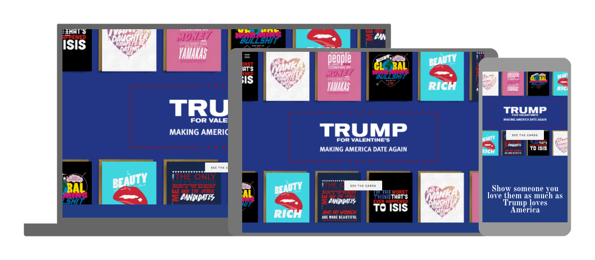
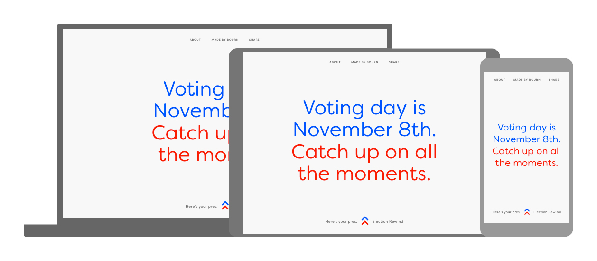
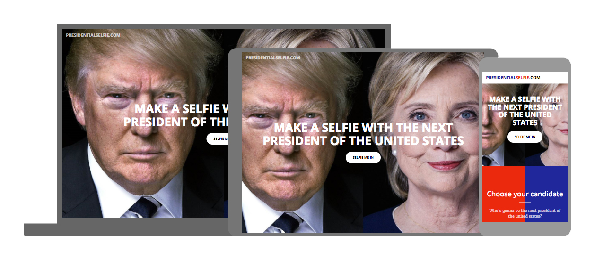
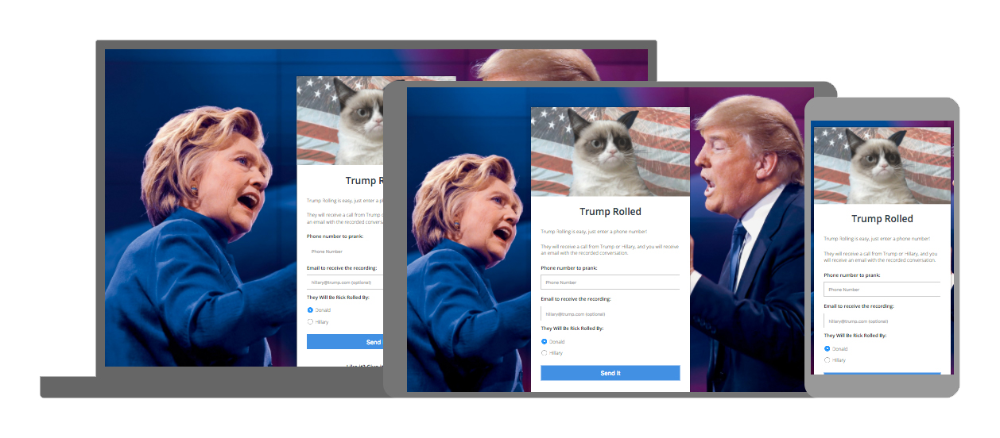

Liam’s Websites of the Month - November US Presidential Edition!!!
==================================================================

November 8th 2016... the date a lot of people have been counting down to... the presidential race to the White House will be over and the world will once again know peace on social media... until the next bunch of Donald Trump quotes come in.

Aloha one and all to a special Presidential Edition of LWOTM in which I have created the biggest listing of LWOTW's for any one blog post. It's been hard to limit the list to just 11 due to the shear number of websites and micro-sites that have popped up due to this historical presidential race. There have been so many things to talk about round this election and people have sprung at the opportunity to create some buzz around the race. Bucckle up chaps it's gonna be a humdinger! 😱

1.[ Hire the Donald](http://hirethedonald.com/)

Possibly the best website on this list details mockingly all of Donald Trump's qualifications to be president. Fueling people to vote for Hilary Clinton highlighting the crazed business mans credentials and quotes. Pulling content from genuine sources is impressive and there are some cute interactive elements such as the endorsement section which moves positive actions when you try to click them 😂 definitely worth a look.

2.[ Clinton and Trump Said...](http://clintonandtrumpsaid.com/)

Trying to find that infamous quote from Donald or just want to know what Hilary thinks about gun control? This website searches Youtube videos from both candidates and find quotes from speeches about the search criteria. Useful for all those times Donald says "I didn't say that!" Yes Donald you did, you definitely did.

3.[ Pussy Grabber](http://pussygrabber.com/)

Those easily offended might jump and squirm at the title of this website but fear not, the premise of this website is to grabd as many cats as possible in a time limit. Obviously playing off of the infamous quote from the vile viral video this website is nothing to fear, just bad humour.

4.[ The Donald Test](http://thedonaldtest.com/)

Ever wondered who you sounded more like, Hilary or Donald? Neither have I! 😂 But with this website they can analyse your Twitter profile tweets to see who you sound like. Those who'd rather not have the ugly truth reveiled enter at your own risk, here be dragons and all 🐲

5.[ And the next President is](http://andthepresidentis.com/)

A very simple website blends the two presidentail candiates profile pictures together based on the current poll results to let you know which candidate is closest to winning. The face of the next president has never looked so terrifying!

6.[ Count Yourself In](https://www.countyourself.in/)

Getting people to the polls has never been more important then it has been for this upcoming election for America and this website provides all the information for people to see how things are turning out the histoyr of their state's voting. Urging people to make sure they're registered to vote and making sure people know the stats.

7.[ Trump for Valentines](http://www.trumpforvalentines.com/)

Donald Trump has provided some memroable moments in the presidential race, they range from luncacy to absolute filth so what better way to tell your significant other you love them with a Valentine's day card with one of Trump's finest? Not a serious business and they don't even sell them you can merely download the template or tweet it if you wish these cards actually have some good designs.

8.[ Election Rewind](http://electionrewind.com/)

Missed what happended in September/October during all the debates? Ever wondered what happened to Bernie Sanders? Was it always a two horse race? Take a load of this interactive timeline for the race to the White House. IT details all the important moments along the way and when people dropped out. Worth a look back to see what you might have missed.

9.[ Presidential Selfie](http://www.presidentialselfie.com/)

Everyone in the world by now must have at least featured in one selfie, the 21st century cannot allow anyone to escape it's arm stretched clutch! Some people are addicted to collecting them with celebrities etc, well now they can can cross two more of their list! This website allows you to upload a photo and have your selfie with either Trump or Hilary. Photoshop master at the ready!

10.[ Trump Rolled](http://trumprolled.com/)

I can name only one person on this earth who likes being Rick Rolled and that's the great man himself, Rick Astley. The last website on this list allows you to setup a prank call as either Hilary or Trump and even emails you the resulting phone conversation (if they stay on the phone long enough). [Click here to see our test prank call.](http://bit.ly/IqT6zt)
