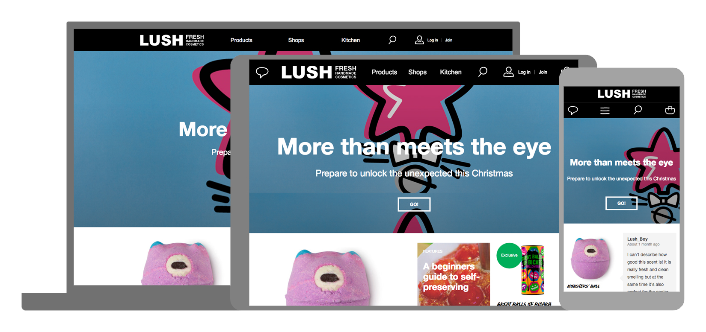
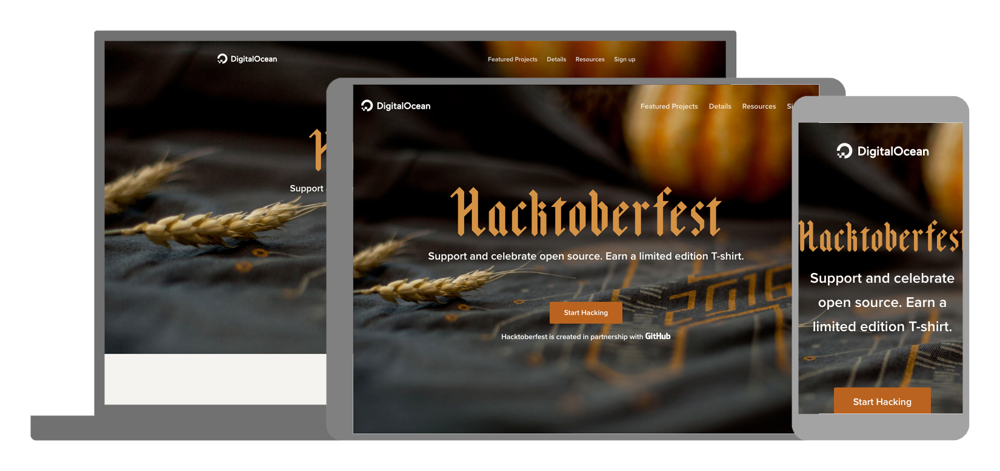
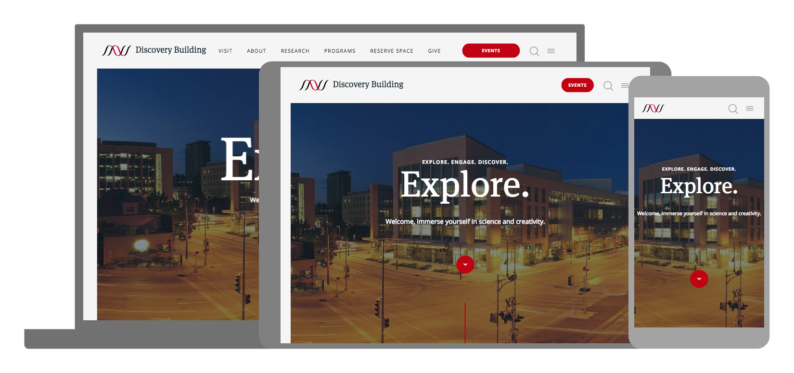
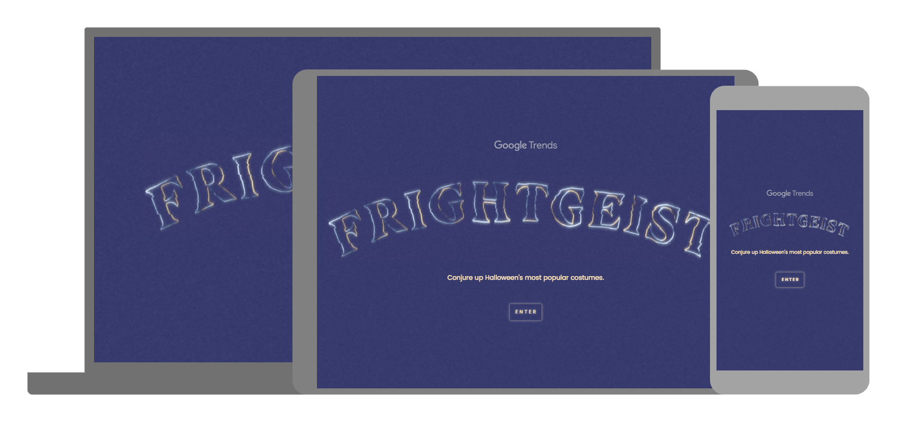
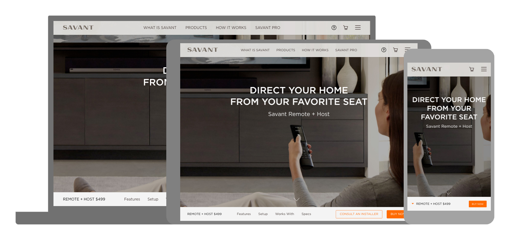

Liam’s Websites of the Month - October Drupal/Developer Special Edition!!!
==========================================================================

Ola amigos!!! Welcome to the very first special edition of LWOTM, hopefully the first of many. Today I'm going to be bringing you all the best websites I've found this month that focus on the wed development industry. SOme of these sites are either built in our beloved Drupal 😍 or just websites relevant to the industry. Get your geek-on and come delve into the depths Codetober!!!

1.[ Lush](https://uk.lush.com/)

So to kick things off, the first winner of the special edition goes to a website built in Drupal 7. A very colourful and useable website, excellent layout and responsive aspects that show off the product excellently. One for the clean and nice smelling folk out there.

2.[ Hacktoberfest](https://hacktoberfest.digitalocean.com/)

Hacktoberfest is a event that's gathered a lot of steam over the last couple of years and is run by Github and the awesome people at Digital Ocean! It's a way to get people inspired to contribute to open source projects and give back to those pojects we all benefit so much from. A nice looking site but the real beauty of this site is it's directive.

3.[ Discovery Building](https://discovery.wisc.edu/)

Another website built in Drupal 7 and a wonderful piece of design with good use of imagery, white space, typography and much more! The Discovery Building website has it all. This website nails it's mission statement "explore, engage, discover" with this website I ticked all three points.

4.[ Google Frightgeist](https://frightgeist.withgoogle.com/)

Halloween might be over but this winner provides some great insights and proof that yes you did indeed see five people dressed up as Harley Quinn and that clown you saw down the road in the dead of night wasn't axe wielding serial killer but just some punk whose been living under a rock and doesn't know that clown costumes aren't cool anymore (arguably they never were). This website you can see what Halloween costumes were trending and find out how likely you were to see a certain character or costume. It's only for the USA but the trending data is accurate and they make good create a very spookey atmossphere for visitors.

5.[ Savant](https://www.savant.com/product/remote-host)

Very much in vain of the Apple website the final winner has some style. The use of big clear and crisp photography, modern colour palette and subtle typography this website achieves the look of a quality company that sells quality products. Did I mention it's built in Drupal 7? Yep! Real nice 😉
I was looking for another winner of the Drupal/Developer bonus LWOTW and I wanted another actual Drupal website to wrap up the special edition of October. So I scoured for more than my normal five minutes to find something special... luckily the Google Gods coupled with patience as long as the list for Donald Trump's sexual, racial and human indecency offences I was able to find something real nice 😄
