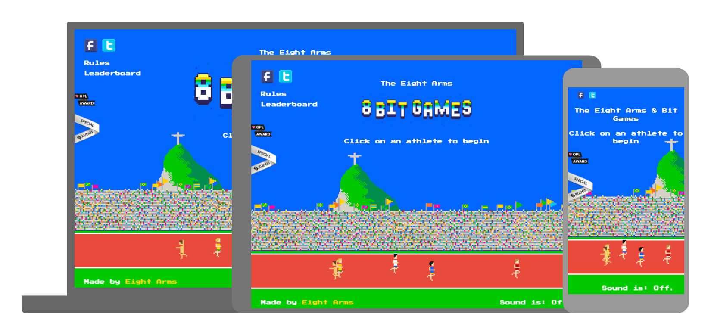
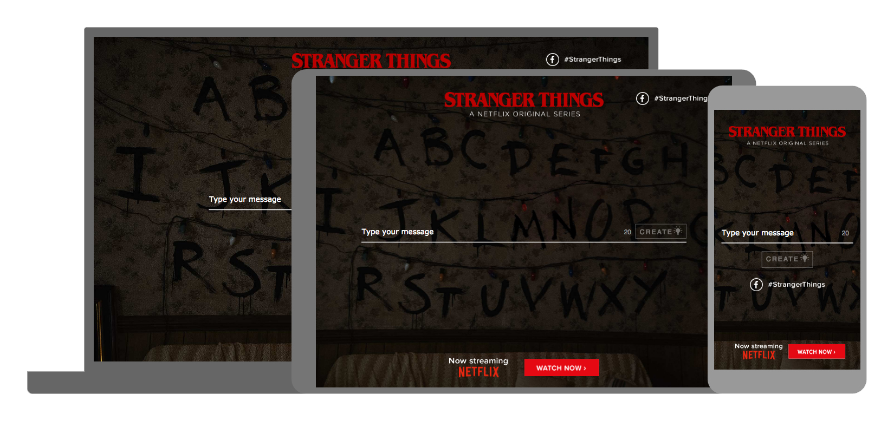
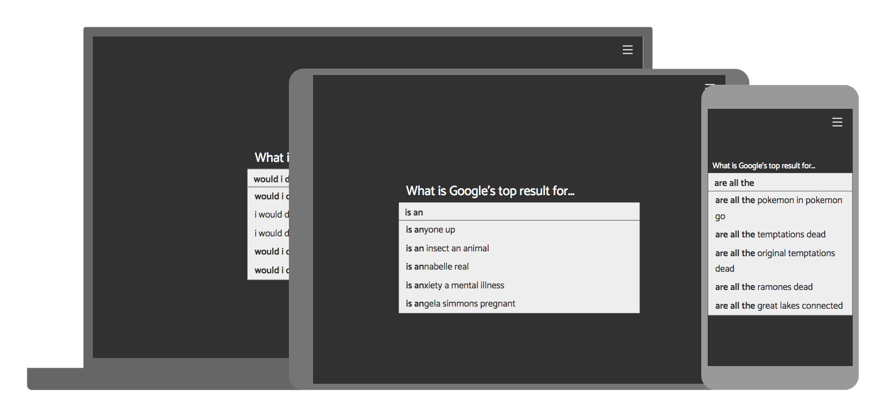
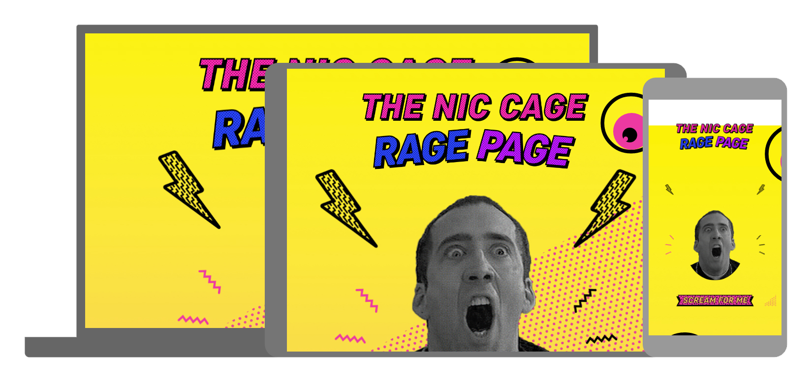

Liam’s Websites of the Month - October Edition
=============================================

Konichiwa internet!!! Here we are again! Another edition of LWOTM! As the long nights close in and the chill of winter begins to threaten let's brighten up your day and warm your cockles with a whole host of internet kindle to stoke your fiery appetite for fun! Snuggle up tight.

1.[ 8 Bit Games](http://8bitgames.eightarms.co.uk/)

This website hits the sweet-spot right after Rio 2016 has wrapped up. A look back into the eight bit past to play some track events with some characters with names straight out of primary school maths questions. Combining simple addictive play, highscores and great eight bit graphics this one should eat some time for a few out there.

2.[ Stranger Things GIF](https://strangergif.com/)

This next website doesn't do much but for all of you Netflix fans out there you can now send your best swears and curses to your loved ones in the form of the Stranger Things blinky light thingy. Using some internet magic similar to how Facebook generates share videos, now you can make your own Stranger Things GIFs and send them to people.

3.[ Idiots Win](http://idiots.win/)

Ever wondered what the zombi-like denizens of the internet gte up to searching on Google? Well now you can unveil the answers with this website. Making use of Google's Suggestion Queries API this website/game is powered by real data so feel free for that jaw to drop in sheer shock at what some of the top search results are for some of Google's most comedy gold autocomplete's.

4.[ The Nic Cage Rage Page](https://ragelikecage.com/)

Have you ever been so angry, so raged that you just need to scream to get it out? Well this website can put your scream on a globally accepted and scientifically accurate scale of rage. This website uses colours most websites would cack their pants at and pulls off a very interesting and unique style. Not the biggest technical piece but featuring microphone API integration this simple idea will put a smile on your face.
