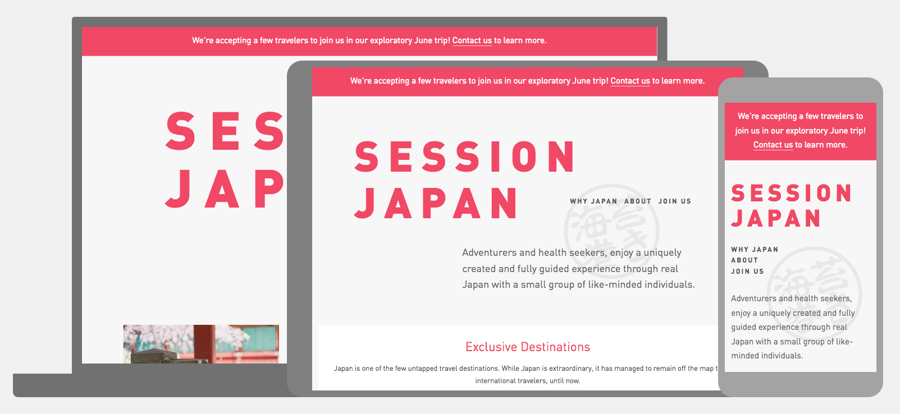
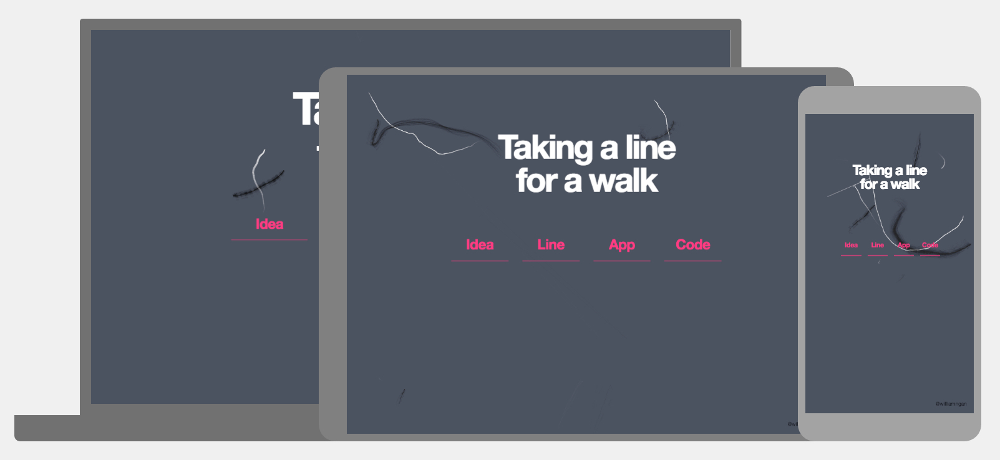
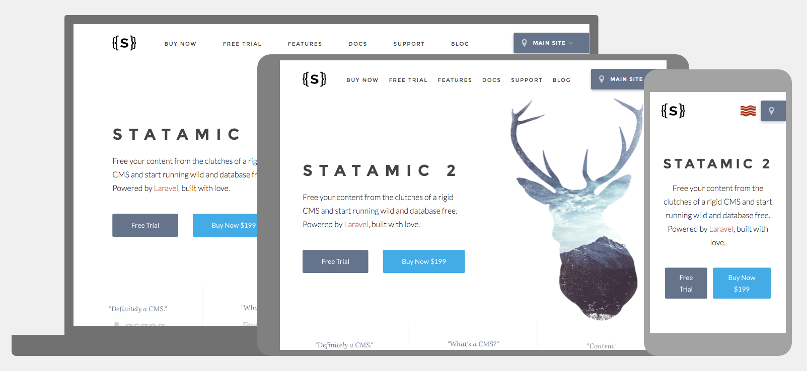
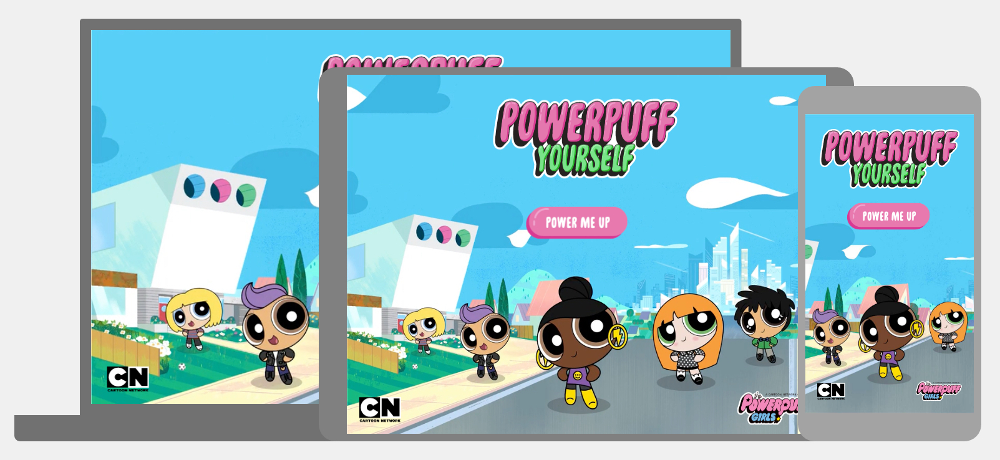
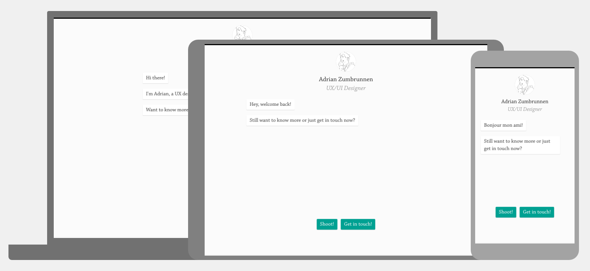
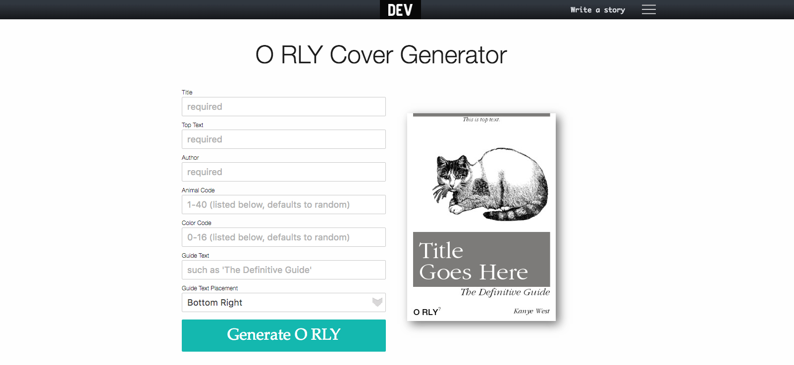
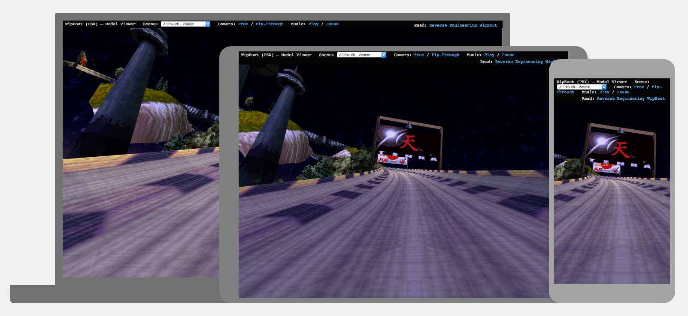
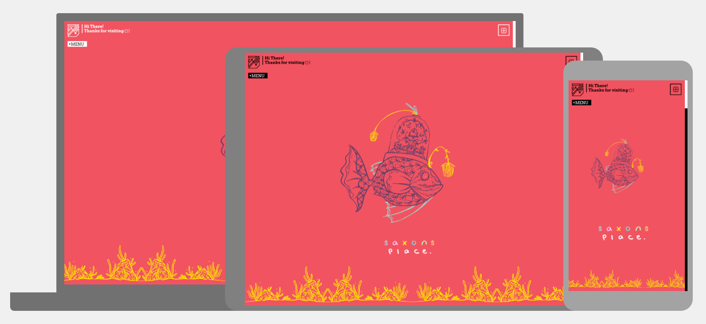

Liam’s Websites of the Month - May Edition
==================================================

Hello once again everyone! Another month means that a whole new host of lovely websites have been collated for your browsing blues. We'll once again dive into the world of the web from beautiful modern designs to the downright crazy and fun! Buckle up.

1.[ Session Japan](http://sessionjapan.com/)

Session Japan is a small company that create fully guided and unique tours around Japan. They only take small groups to be able to deliver a more personal and intimate excursion for all involved. Their website is a shining example of what can be done with minimal design on the web. Everything from the elegant typography to the colour pallete is carefully thought through and the subtle asian influences really ties the website to the subject matter. A beauty to behold.

2.[ Taking a line for a walk](http://williamngan.github.io/line/)

[https://twitter.com/williamngan](William Ngan) was inspired by one of his [https://medium.com/@williamngan/taking-a-line-for-a-walk-6fd947acb227#.59de0nnpp](favourite artists attempt) at creating his signature art through an iPad rather than traditional materials to create something that could change how lines are drawn on a digital canvas to form a different approach to digital drawing. This website showcases that if you think outside the box and question the way things are normally done then we can get better results.

3.[ Statamic](https://statamic.com/)

Statamic is a flat-file CMS built on the widely popular PHP framework Laravel (specifically Laravel 5.1). The developers at Statamic have developed a CMS that doesn't rely on a database to store website content and instead stored as content files. Quite a revolution in terms of thinking but what's just as good is the website that sells the product is filled with just as much love, fun and attention to detail as it's shipping product! The [https://docs.statamic.com/guides](documentation) illustrates this excellently. Couple their unique copy writing style with a elegant and modern web design and it's ticking all the boxes.

4.[ Powerpuff Yourself](https://www.powerpuffyourself.com/#!/en)

This entry was unique in the list because it was chosen from this [Twitter poll](https://twitter.com/LiamWalshWeb/status/720891895292014593) because I simply couldn't make my mind up on what I loved more, Powerpuff Girls or Pokemon! The winner in the end was Powerpuff Yourself.
Simply put, if you ever wanted to know what you looked like as a Powerpuff Girl now you can! This website makes impressive use of SVGs, a wonderful Javscript library called [Vue.js](https://vuejs.org/) along with sugar, spice and everything nice to make something fun and inspiring.

5.[ Adrian Zumbrunnen](http://azumbrunnen.me/)

Here is [Adrian Zumbrunnen](https://twitter.com/@azumbrunnen_) a UX and UI Designer from Zurich, Switzerland with a very different kind of portfolio website. Instead of the usual opening in modern web design with a big splash image and evocative caption he opens his website up with a conversation that you can respond to. Something you don't see everyday in web design he invites you to engage on a more personal and natural level. Coupled with a very clear and concise structured website makes this one you won't forget.

6.[ O RLY Cover Generator](https://dev.to/rly)

How many of you have read an O’Reilly book? If you're in the web industry from anywhere since it's conception till now then you probably have your hand up in answer to this question. This website allows you to generate your own hilarious, quick-witted and/or pun-tastic O’Reilly book covers with all the animal flavours to boot! The reason why it's so great speaks for itself. Why not tweet us with your creations?

7.[ WipEout (PSX) – Model Viewer](http://phoboslab.org/wipeout/)

Remember an era before online gaming? Most of us who do remember when playing with somebody else meant being sat next to them. One such game was Wipeout a single and multiplayer racing game that delivered high speed futuristic racing to the Playstation 1. Many people remember the game for it's crazy tracks, far-distant future settings and sheer speed of racing. Well [PhobosLab](http://phoboslab.org/) has managed to reverse engineer this racing games tracks to be viewable through the web with the magic of WebGL! An impressive feat.

8.[ Saxons Place](https://saxons.place/)

Welcome to Saxons Place! This website is a place full of colour and vibrance! Standing out from the crowd of monotonous websites this website uses it's character and subtle use of animation to display a variety of colourful illustrations to draw the eye to every inch of the screen. Without overpowering the eye this truly becomes a place to revisit.
