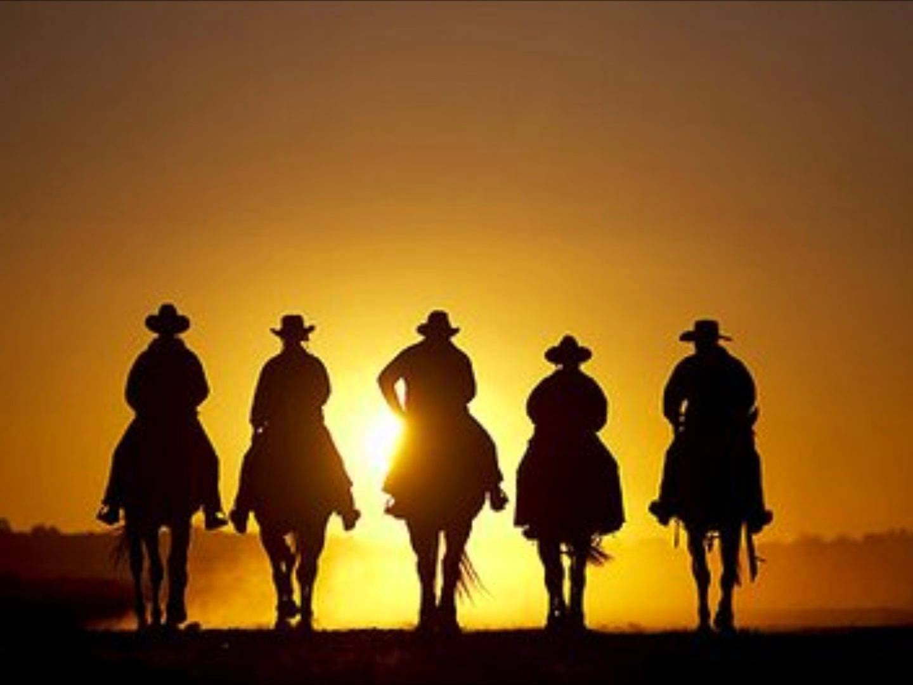

My First Drupal Camp - Bristol 2016
===================================

For most of the development team here at Access this years visit to Drupal Camp Bristol was just another Drupal Camp for their attendance tally, for me however this would be the first Drupal Camp and Drupal related event I would ever attend! My name is [Liam Walsh](https://twitter.com/LiamWalshWeb) and I'm a front end developer at Access and I'm the one in the picture below that's second from the right.

<blockquote class="twitter-tweet" data-lang="en">
...and they&#39;re off, the awesome foursome are en route to <a href="https://twitter.com/DrupalCampBris">@DrupalCampBris</a> <a href="https://twitter.com/hashtag/drupal?src=hash">#drupal</a> <a href="https://twitter.com/hashtag/drupalcampbristol?src=hash">#drupalcampbristol</a> <a href="https://t.co/Xtgxz8pUP5">pic.twitter.com/Xtgxz8pUP5</a>
&mdash; Access (@accessdigital) <a href="https://twitter.com/accessdigital/status/756482285583630336">July 22, 2016</a></blockquote>

I have attended conferences before for various things but despite working at Access for more than 2 years now I had somehow avoided going to any Drupal Camps. A few reasons including; not feeling I would enjoy the event as much as someone else on the team and volunteering to stay behind, not being sure of what such an event would be like (would I be out of my knowledge depth? Feel uncomfortable amongst such well established Drupal vets?) and sometimes just because I would rather stay in my comfort zone rather than challenge my developer social skills.

## The Departure

So we set off on the road on the Friday afternoon to stay overnight and be ready nice and early to attend the event. The drive down was a warm one, it was either all the windows down or full blast air conditioning to try and keep the devs CPUs cool!

## The Camp Saturday Morning

The morning kicked off with a talk from one of the organisers of the event about contributing to Drupal and open source projects and was joined by a man who was doing his first talk at a Drupal Camp who had experienced the similar issues as we all do when we first set out to start giving back to the community. He talked about the reserach he and conducted at a company to try and understand why more people using open source and Drupal didn't feel like and or couldn't give back to that which most of them made their living off.

This was a great first talk to open the day with, especially for myself being a newcomer and have though about trying to contribute to Drupal before but never quite knowing how, why or when to do so. They're talk was very well spoken and also very relatble and had the attendtion of everyone in the room.

<blockquote class="twitter-tweet" data-lang="en">
.<a href="https://twitter.com/RickDonohoe">@RickDonohoe</a> kicking off the <a href="https://twitter.com/hashtag/dcbristol16?src=hash">#dcbristol16</a> conference day. <a href="https://t.co/g3TOceW3Cn">pic.twitter.com/g3TOceW3Cn</a>
&mdash; DrupalCamp Bristol (@DrupalCampBris) <a href="https://twitter.com/DrupalCampBris/status/756770053543034881">July 23, 2016</a></blockquote>

## Tea Break

We then had a short break for beverages before we went to witness the one-man-band himself and Access' own [Ashley Johnson](https://twitter.com/johnnnnson) present his talk on his Project Management Toolbox.

<blockquote class="twitter-tweet" data-lang="en">
.<a href="https://twitter.com/johnnnnson">@johnnnnson</a> taking everyone through the project management toolbox <a href="https://twitter.com/hashtag/drupal?src=hash">#drupal</a> <a href="https://twitter.com/hashtag/dcbristol16?src=hash">#dcbristol16</a> <a href="https://t.co/Kb0QQ3u6r9">pic.twitter.com/Kb0QQ3u6r9</a>
&mdash; DrupalCamp Bristol (@DrupalCampBris) <a href="https://twitter.com/DrupalCampBris/status/756790373704491008">July 23, 2016</a></blockquote>

Ash talked about all the lovely tools that we use here at Access to try and make our professional life easier and more efficient so that we can be the best that we can. It was comforting to see a fellow colleague up on stage delivering an excellent and useful talk and it was even better to look around and see people engaging and really listening to what he had to say. It gave me confidence that I might one day speak at such an event with as much gusto and our man did.

## Lunch Time!!!

We then broke up for lunch that was lovingly put together by the event hosts so that all could stay and not have to rush finding lunch elsewhere. So far the day had gone very well, we'd spoken to some of the organisers and other attendees, those known previously and also new faces. The rest of the Access memebers made note that this was not nearly as busy as many of the other Drupal Camps they had attended perviously which was probably a bit of luck for me. I didn't feel like just disappearing into the crowd and staying out of sight instead I felt that at any point I could approach somebody. The atmosphere was very welcoming and the organisers made effort to approach everyone at least once to try and break the ice.

## The Talks

The rest of the afternoon consisted of more talks, two of my favourites were "[Offline First](https://www.drupalcampbristol.co.uk/session/offline-first)" by [Erik Erskine](https://twitter.com/erikerskine) and thge long winded titled "[How to deal with a life of crazy and keep your cool, mostly](https://www.drupalcampbristol.co.uk/session/how-to-deal-with-a-life-of-crazy-and-keep-your-cool-mostly)" by [Justine Pocock](https://twitter.com/wigglykoala) (probably the best Twitter name I've ever seen).

The first talk by Erik was very technical and showed how you could use progressive enhancement to build websites with offline capability so that people can view your content regardless of where they are. If they've visited your site before and then go back to it say during their tarvels and find themselves offline due to poor connectivity then they can still read your website as it was when they last visited it. Incredible...

The second talk by Justine went through her personal struggles in life and how she and others in the Drupal commiunity helped so she could overcome her problems in order to become who she really wanted to be, again a very inspiring piece and another amazing coincidence for me as it gave me another boost for working my way up to speak at a conference. She herself went through the stages of being an attendee to eventually being a speaker! It shows how supportive and effective the Drupal community can be when they are needed.

## The Quiz and wrapping up!

We ended the day with a Drupal-ish quiz! With everyone who was attending in the same room. Some of the questions were Drupal specific and some were just general knowledge but everyone joined in and everyone contributed. The quiz had some great prizes so everyone was enagaged and wanting to win. Laughs and smiles were shared and I felt very at relaxed and that allowed me to enjoy myself fully. We ended up finishing an admirable 5th out of about ten teams so not bad.

<blockquote class="twitter-tweet" data-lang="en">
The Dru-pals clock in a healthy fifth place win at the <a href="https://twitter.com/hashtag/dcbristol16?src=hash">#dcbristol16</a> quiz <a href="https://t.co/mUSFGqOLBr">pic.twitter.com/mUSFGqOLBr</a>
&mdash; Access (@accessdigital) <a href="https://twitter.com/accessdigital/status/756878384618143744">July 23, 2016</a></blockquote>

And then it all came to a close! we joined the rest of the community at the chosen hotspot for more drinks socialising and that was that! A whole day at a Drupal Camp done and I didn't remember why I was so nervous about attending one! After the post-conference drinks people parted ways and the boys from Acces road off into the sunset...

