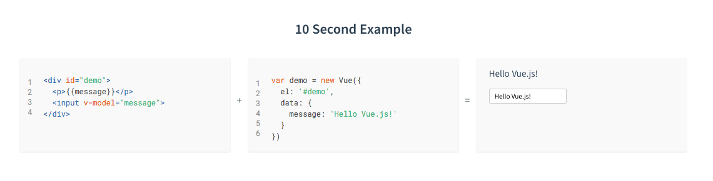
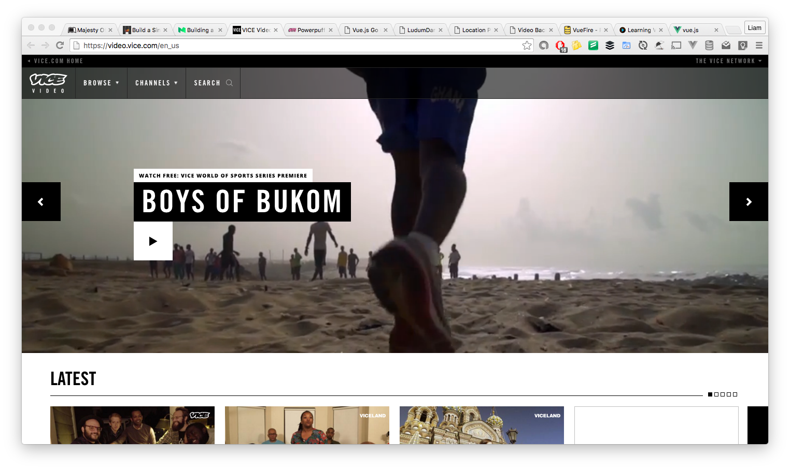
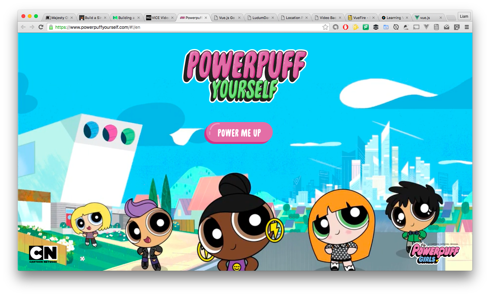

Vue.js - A New Challenger Approaches
====================================

Javascript MVCs are bigger than ever in the web development world and in recent years we've been spoilt for choice with frameworks like Angular, Ember and Backbone to name but a few of the more popular. In 2015 a new challenger rose to fame and fandom, [Vue.js](http://vuejs.org/).

Vue describes itself as _"Reactive Components for Modern Web Interfaces"_ and looking at the basic example it shows how simple this library is.

Vue was not designed to be a direct competitor to full stack MVC frameworks like Angular etc because it soley focuses on the view layer in the MVC definition but because of the extensibility of the Vue library it has the ability to be used for very simple examples like above or for full SPAs (single page applications) and some examples of Vue being used for SPAs are the [Video VICE](https://video.vice.com/en_us) website and the fun and experimental [Power Puff Yourself](https://www.powerpuffyourself.com/#!/en) website.

So why all the fuss?
